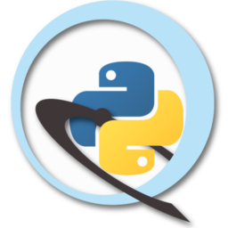
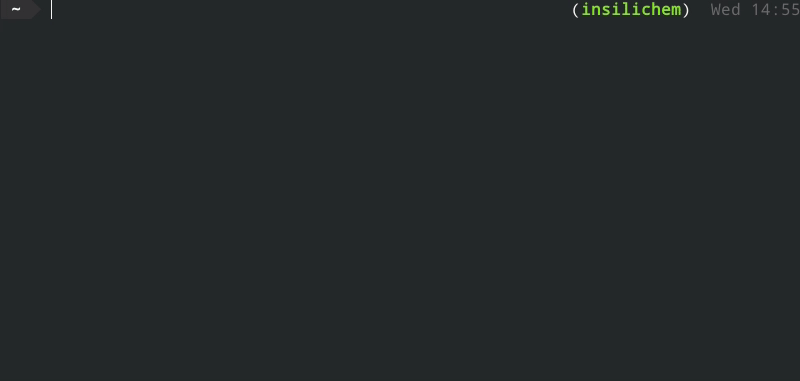

PyChimera
=========

.. image:: https://travis-ci.org/insilichem/pychimera.svg?branch=master
   :target: https://travis-ci.org/insilichem/pychimera
   :alt: Travis CI status

.. image:: https://ci.appveyor.com/api/projects/status/fwp3uum6be7tcfqn/branch/master?svg=true
   :target: https://ci.appveyor.com/project/jaimergp/pychimera
   :alt: AppVeyor status

.. image:: https://readthedocs.org/projects/pychimera/badge/?version=latest
   :target: http://pychimera.readthedocs.io/en/latest/?badge=latest
   :alt: Documentation Status

.. image:: https://img.shields.io/badge/doi-10.1093%2Fbioinformatics%2Fbty021-blue.svg
   :target: http://dx.doi.org/10.1093/bioinformatics/bty021
   :alt: Citation DOI

**Use UCSF Chimera packages in any Python 2.7 interpreter**

With PyChimera you can…

-  Run scripts depending on chimera **from CLI** with ``pychimera script.py``.
-  Enable ``import chimera`` in interactive coding sessions **outside UCSF Chimera**,
   including IPython and Jupyter Notebooks.
-  Launch a standard UCSF Chimera instance, with the benefit of importing all
   your ``conda`` or ``virtualenv`` packages with ``pychimera --gui``.

I hope it’s useful! Feedback is appreciated!

Documentation
-------------

The updated documentation is always available at `readthedocs`_.

Acknowledgments
---------------

Largely based on ideas by `Greg Couch at chimera-users`_.

.. _UCSF Chimera: https://www.cgl.ucsf.edu/chimera/
.. _latest UCSF Chimera: http://www.cgl.ucsf.edu/chimera/download.html
.. _Greg Couch at chimera-users: http://www.cgl.ucsf.edu/pipermail/chimera-users/2015-January/010647.html
.. _readthedocs: http://pychimera.readthedocs.io

Citation
--------

.. image:: https://img.shields.io/badge/doi-10.1093%2Fbioinformatics%2Fbty021-blue.svg
   :target: http://dx.doi.org/10.1093/bioinformatics/bty021

PyChimera is scientific software, funded by public research grants
(Spanish MINECO's project ``CTQ2014-54071-P``, Generalitat de Catalunya's
project ``2014SGR989`` and research grant ``2017FI_B2_00168``, COST Action ``CM1306``).
If you make use of PyChimera in scientific publications, please cite it. It will help
measure the impact of our research and secure future funding!

.. code-block:: latex

   @article{pychimera2018,
     author = {Rodríguez-Guerra Pedregal, Jaime and Maréchal, Jean-Didier},
     title = {PyChimera: use UCSF Chimera modules in any Python 2.7 project},
     journal = {Bioinformatics},
     volume = {34},
     number = {10},
     pages = {1784-1785},
     year = {2018},
     doi = {10.1093/bioinformatics/bty021},
     URL = {http://dx.doi.org/10.1093/bioinformatics/bty021},
     eprint = {/oup/backfile/content_public/journal/bioinformatics/34/10/10.1093_bioinformatics_bty021/1/bty021.pdf}
   }